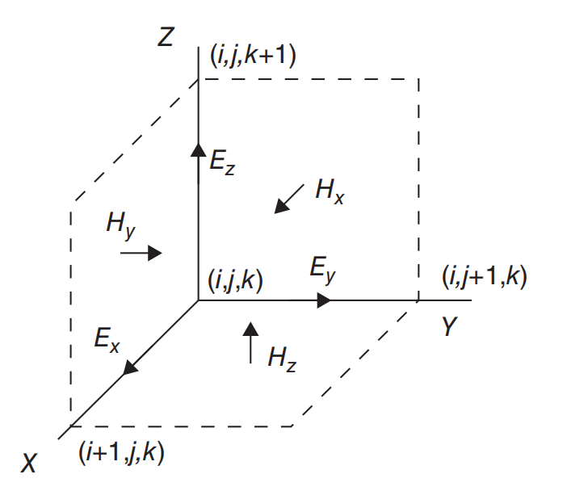

### 1、fdtd原理简介

#### 1.1基本方程

​		构造FDTD算法的出发点是麦克斯韦时域方程

$$
\nabla \times H =\partial D /\partial t + J \\
\nabla \times E =-\partial B /\partial t - M \\
\nabla \cdot D = \rho_{e} \\
\nabla \cdot B = \rho_{m}
$$
式中：\$E)\$为电场强度（V/m）;D为电位移（C/m^2）;H为磁场强度（A/m）；B为磁通量密度（Wb/m^2）；J为电流密度（A/m^2）；M为磁流密度（V/m^2）；rhoe为电荷密度（C/m^2）；rhom为磁荷密度（Wb/m^2）。  

​		对线性、各向同性和非色散媒质可以写成：
$$
D = \epsilon E \\
B = \mu H
$$
式中：epsilon为媒质的介电常数，mu为媒质的磁导率。在自由空间，有：

$$
\epsilon = \epsilon_0 = 8.854 \times 10^{-12} \enspace F/m \\
\mu = \mu_0 = 4 \pi \times 10^{-7} \enspace H/m
$$
​		上式有两个矢量方程组成，在三维空间每个矢量方程可以分解为三个标量方程，因此麦克斯韦旋度方程可以表示成六个标量方程，在直角坐标系下，有：

$$
\frac{\partial D_x}{\partial t} = \frac{1}{\sqrt{\epsilon_0 \mu_0}} (\frac{\partial H_z}{\partial y}-\frac{\partial H_y}{\partial z}) \\
\frac{\partial D_y}{\partial t} = \frac{1}{\sqrt{\epsilon_0 \mu_0}} (\frac{\partial H_x}{\partial z}-\frac{\partial H_z}{\partial x}) \\
\frac{\partial D_z}{\partial t} = \frac{1}{\sqrt{\epsilon_0 \mu_0}} (\frac{\partial H_y}{\partial x}-\frac{\partial H_x}{\partial y}) \\
\frac{\partial H_x}{\partial t} = \frac{1}{\sqrt{\epsilon_0 \mu_0}} (\frac{\partial E_y}{\partial z}-\frac{\partial E_z}{\partial y}) \\
\frac{\partial H_y}{\partial t} = \frac{1}{\sqrt{\epsilon_0 \mu_0}} (\frac{\partial E_z}{\partial x}-\frac{\partial E_x}{\partial z}) \\
\frac{\partial H_z}{\partial t} = \frac{1}{\sqrt{\epsilon_0 \mu_0}} (\frac{\partial E_x}{\partial y}-\frac{\partial E_y}{\partial x}) \\
$$


#### 1.2 三维问题FDTD更新方程

​		最初的FDTD是由Yee细胞来描述的，假设E和H场交错在一个单元格周围，其原点在位置i、j和k。每个E场位于距离原点方向方向的半个单元格宽度；除了方向外，每个H场在每个方向上都偏移半个单元格。



以上标量编程以下矢量方程：

$$
D_z^{n+1/2}(i,j,k+\frac{1}{2})=D_z^{n-1/2}(i,j,k+\frac{1}{2})+\frac{\Delta t}{\Delta x \cdot \sqrt{\epsilon_0  \mu_0}} \\ [H_y^n(i+\frac{1}{2},j,k+\frac{1}{2}) -H_y^n(i-\frac{1}{2},j,k+\frac{1}{2}) \\-H_x^n(i,j+\frac{1}{2},k+\frac{1}{2})+H_x^n(i,j-\frac{1}{2},k+\frac{1}{2})] \\

H_z^{n+1}(i+\frac{1}{2},j+\frac{1}{2},k)=H_z^{n}(i+\frac{1}{2},j+\frac{1}{2},k)+\frac{\Delta t}{\Delta x \cdot \sqrt{\epsilon_0  \mu_0}} \\ [E_x^{n+1/2}(i+\frac{1}{2},j+1,k) -E_x^{n+1/2}(i+\frac{1}{2},j,k) \\-E_y^{n+1/2}(i+1,j+\frac{1}{2},k)+E_y^{n+1/2}(i,j+\frac{1}{2},k)]
$$
其中n+1表示一个时间步长之后。对于3D FDTD仿真，电场和磁场都是思维数据，其中前三维表示x、y、z空间，第四位表示x、y、z分量。Nx、Ny、Nz表示空间长度。

```python
E = np.zeros((Nx, Ny, Nz, 3))
H = np.zeros((Nx, Ny, Nz, 3))
```

 计算旋度：

```python
def curl_E(E) :
    curl = np.zeros(E.shape)

    curl[:, :-1, :, 0] += E[:, 1:, :, 2] - E[:, :-1, :, 2]
    curl[:, :, :-1, 0] -= E[:, :, 1:, 1] - E[:, :, :-1, 1]

    curl[:, :, :-1, 1] += E[:, :, 1:, 0] - E[:, :, :-1, 0]
    curl[:-1, :, :, 1] -= E[1:, :, :, 2] - E[:-1, :, :, 2]

    curl[:-1, :, :, 2] += E[1:, :, :, 1] - E[:-1, :, :, 1]
    curl[:, :-1, :, 2] -= E[:, 1:, :, 0] - E[:, :-1, :, 0]
    return curl


def curl_H(H) :
    curl = np.zeros(H.shape)

    curl[:, 1:, :, 0] += H[:, 1:, :, 2] - H[:, :-1, :, 2]
    curl[:, :, 1:, 0] -= H[:, :, 1:, 1] - H[:, :, :-1, 1]

    curl[:, :, 1:, 1] += H[:, :, 1:, 0] - H[:, :, :-1, 0]
    curl[1:, :, :, 1] -= H[1:, :, :, 2] - H[:-1, :, :, 2]

    curl[1:, :, :, 2] += H[1:, :, :, 1] - H[:-1, :, :, 1]
    curl[:, 1:, :, 2] -= H[:, 1:, :, 0] - H[:, :-1, :, 0]

    return curl
```

#### 1.3 FDTD方法的稳定条件

​		FDTD方法的数值稳定性要求时间增量delta t相对于空间网格小于一特定值，即有：

$$
\Delta t \leqslant \frac{1}{c \sqrt{\frac{1}{(\Delta x)^2}+\frac{1}{(\Delta y)^2}+\frac{1}{(\Delta z)^2}}}
$$
式中c为自由空间中的光速。方程表明，在一个时间步长内，不容许波进行距离超过一个网格的尺寸。

```python
D = int(Nx > 1) + int(Ny > 1) + int(Nz > 1) #计算仿真维度
max_courant_number = float(self.D) ** (-0.5)
courant_number = 0.99 * max_courant_number #计算稳定因子
inverse_permittivity = np.ones((Nx, Ny, Nz, 3)) / float(permittivity) #计算介电常数的倒数
inverse_permeability = np.ones((Nx, Ny, Nz, 3)) / float(permeability)#计算磁导率的倒数

curl = curl_H(self.H)
E += courant_number * inverse_permittivity * curl #更新电场

curl = curl_E(E)
H -= courant_number * inverse_permeability * curl #更新磁场
```
